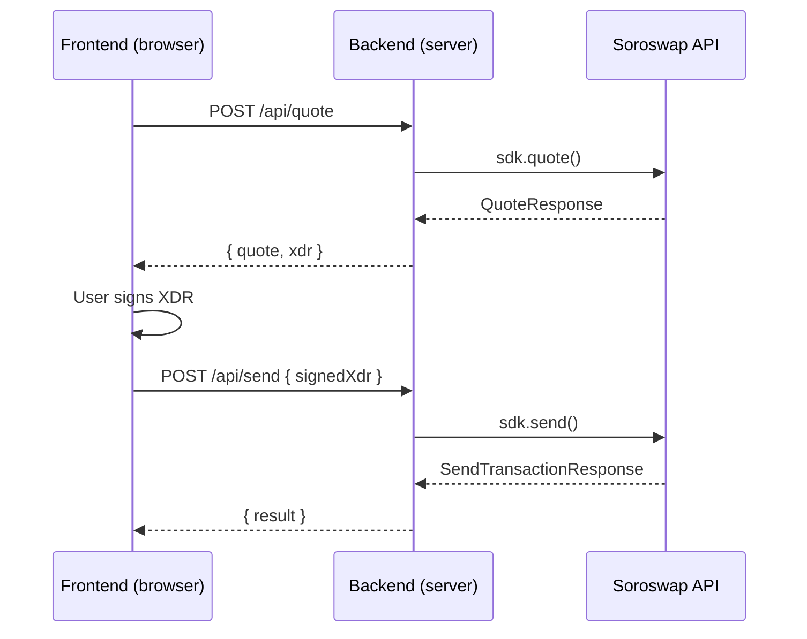

# Soroswap SDK Integration

## Overview

The Soroswap SDK (`@soroswap/sdk`) provides TypeScript access to the Soroswap DEX aggregator on Stellar. The SDK communicates with the Soroswap API using an API key and returns **unsigned XDR transactions** that must be signed before submission.

**Core flow:** Initialize SDK with API key -> call SDK method -> receive unsigned XDR -> sign with wallet or keypair -> submit via `sdk.send()`.

## When to Use

- Building a backend that performs token swaps on Stellar
- Adding/removing liquidity to Soroswap pools
- Querying token prices, pool data, or wallet balances
- Building a swap widget or trading interface
- Any programmatic interaction with Soroswap DEX (aggregator, router, or SDEX)

## Installation

```bash
pnpm add @soroswap/sdk
# If signing server-side:
pnpm add @stellar/stellar-sdk
```

## API Key Security

**The SDK requires an API key (`sk_...`) for all operations.** The API key is sent as a Bearer token in every request.

**Backend usage (recommended):** Initialize the SDK on the server. The API key stays in environment variables and is never exposed to the client. The frontend communicates with your backend, which proxies requests to the Soroswap API.

**Frontend usage (possible but risky):** If you initialize the SDK directly in the browser, **your API key will be visible** in network requests. This is acceptable for free-tier keys during development, but **never expose a paid/tiered API key** in client-side code. If you must use the SDK in the frontend, understand that anyone can extract and use your key.

## SDK Setup

```typescript
import { SoroswapSDK, SupportedNetworks } from "@soroswap/sdk";

const sdk = new SoroswapSDK({
  apiKey: process.env.SOROSWAP_API_KEY as string,  // Required: starts with 'sk_'
  baseUrl: process.env.SOROSWAP_API_URL,           // Optional: defaults to 'https://api.soroswap.finance'
  defaultNetwork: SupportedNetworks.MAINNET,        // Optional: defaults to MAINNET
  timeout: 30000,                                   // Optional: defaults to 30000ms
});
```

## Transaction Signing

The SDK builds unsigned XDR transactions. How you sign depends on your architecture.

### Backend Signing (with Keypair)

For scripts, bots, or server-side execution where you control the signing key:

```typescript
import { Keypair, Networks, Transaction, TransactionBuilder } from "@stellar/stellar-sdk";

// After receiving XDR from any SDK method:
const transaction = TransactionBuilder.fromXDR(
  response.xdr,
  Networks.PUBLIC  // or Networks.TESTNET
) as Transaction;

transaction.sign(Keypair.fromSecret(process.env.STELLAR_SECRET_KEY as string));

const result = await sdk.send(transaction.toXDR(), false, SupportedNetworks.MAINNET);
```

**Use `Networks.PUBLIC` or `Networks.TESTNET`** (from `@stellar/stellar-sdk`) when parsing XDR. These are different from `SupportedNetworks.MAINNET`/`SupportedNetworks.TESTNET` (from `@soroswap/sdk`) which are used for SDK method calls.

### Frontend Signing (with Wallet)

For web apps where users sign with their own wallet. Your backend builds the XDR, returns it to the frontend, and the user signs with their wallet:

```typescript
// Backend: build XDR and return it to the frontend
// Frontend: sign with any Stellar wallet (Freighter, LOBSTR, etc.)
const { signedTxXdr } = await walletKit.signTransaction(xdr, {
  address: userAddress,
  networkPassphrase: "Public Global Stellar Network ; September 2015",
});

// Send signed XDR back to your backend, which calls sdk.send()
```

The signing method depends entirely on your wallet integration. The SDK is agnostic to how signing happens - it only needs the signed XDR string.

## Swap Operations

### Full Swap Flow: Quote -> Build -> Sign -> Send

```typescript
import {
  SoroswapSDK,
  QuoteRequest,
  BuildQuoteRequest,
  TradeType,
  SupportedNetworks,
  SupportedProtocols,
} from "@soroswap/sdk";

// 1. Get a quote
const quoteRequest: QuoteRequest = {
  assetIn: "CCW67TSZV3SSS2HXMBQ5JFGCKJNXKZM7UQUWUZPUTHXSTZLEO7SJMI75",  // USDC contract
  assetOut: "CAS3J7GYLGXMF6TDJBBYYSE3HQ6BBSMLNUQ34T6TZMYMW2EVH34XOWMA", // XLM contract
  amount: 1000000000n,                    // 100 USDC (7 decimals) - MUST be BigInt
  tradeType: TradeType.EXACT_IN,          // or TradeType.EXACT_OUT
  protocols: [SupportedProtocols.SOROSWAP, SupportedProtocols.AQUA],
  slippageBps: 50,                        // 0.5% slippage in basis points
  maxHops: 2,                             // Optional: max routing hops
};

const quote = await sdk.quote(quoteRequest, SupportedNetworks.MAINNET);
// quote.amountIn, quote.amountOut, quote.priceImpactPct, quote.routePlan

// 2. Build transaction XDR from quote
const buildRequest: BuildQuoteRequest = {
  quote,
  from: "GXXXXXXX...",                    // Sender wallet address
  to: "GXXXXXXX...",                      // Optional: recipient (defaults to 'from')
};

const buildResponse = await sdk.build(buildRequest, SupportedNetworks.MAINNET);
// buildResponse.xdr - unsigned transaction XDR

// 3. Sign the XDR (see Transaction Signing section above)
const signedXdr = signTransaction(buildResponse.xdr);

// 4. Send signed transaction
const result = await sdk.send(signedXdr, false, SupportedNetworks.MAINNET);

if (result.success && result.result?.type === "swap") {
  console.log(`Swapped ${result.result.amountIn} for ${result.result.amountOut}`);
}
```

### Quote Request Options

| Field | Type | Required | Description |
|---|---|---|---|
| `assetIn` | `string` | Yes | Input token contract address |
| `assetOut` | `string` | Yes | Output token contract address |
| `amount` | `bigint` | Yes | Amount in smallest unit (stroops) |
| `tradeType` | `TradeType` | Yes | `EXACT_IN` or `EXACT_OUT` |
| `protocols` | `SupportedProtocols[]` | Yes | Protocols to route through |
| `slippageBps` | `number` | No | Slippage tolerance in basis points |
| `maxHops` | `number` | No | Max routing hops |
| `parts` | `number` | No | Split parts for aggregation |
| `feeBps` | `number` | No | Platform fee in basis points |

### Platform Fee & Referral

If you set `feeBps` in the quote, you **must** provide `referralId` in the build request:

```typescript
const quote = await sdk.quote({ ...quoteRequest, feeBps: 30 }); // 0.3% fee
const build = await sdk.build({
  quote,
  from: walletAddress,
  referralId: "GREFERRAL...",  // Wallet receiving the fee
});
```

## Liquidity Operations

### Add Liquidity

```typescript
import { AddLiquidityRequest } from "@soroswap/sdk";

const addRequest: AddLiquidityRequest = {
  assetA: "TOKEN_A_CONTRACT",
  assetB: "TOKEN_B_CONTRACT",
  amountA: 1000000000n,                // BigInt
  amountB: 5000000000n,                // BigInt - must match pool ratio
  to: "GWALLET...",                     // Recipient of LP tokens
  slippageBps: "100",                   // 1% - note: string for liquidity methods
};

const response = await sdk.addLiquidity(addRequest, SupportedNetworks.MAINNET);
// response.xdr - unsigned XDR to sign
// response.type - 'create_pool' | 'add_liquidity'
// response.poolInfo - pool details

// Sign and send as usual
```

**Amounts must match the current pool ratio.** Fetch the pool first to calculate proportions:

```typescript
const pools = await sdk.getPoolByTokens(assetA, assetB, network, protocols);
const ratio = Number(pools[0].reserveB) / Number(pools[0].reserveA);
const amountB = BigInt(Math.floor(Number(amountA) * ratio));
```

### Remove Liquidity

```typescript
import { RemoveLiquidityRequest } from "@soroswap/sdk";

const removeRequest: RemoveLiquidityRequest = {
  assetA: "TOKEN_A_CONTRACT",
  assetB: "TOKEN_B_CONTRACT",
  liquidity: 500000000n,               // LP tokens to burn
  amountA: 400000000n,                 // Min expected token A
  amountB: 2000000000n,                // Min expected token B
  to: "GWALLET...",
  slippageBps: "100",
};

const response = await sdk.removeLiquidity(removeRequest, SupportedNetworks.MAINNET);
// Sign and send response.xdr
```

### User Positions

```typescript
const positions = await sdk.getUserPositions("GWALLET...", SupportedNetworks.MAINNET);

for (const pos of positions) {
  console.log(`Pool: ${pos.poolInformation.address}`);
  console.log(`Shares: ${pos.userShares}`);
  console.log(`Token A equivalent: ${pos.tokenAAmountEquivalent}`);
  console.log(`Token B equivalent: ${pos.tokenBAmountEquivalent}`);
}
```

## Read-Only Operations

### Token Prices

```typescript
// Single token
const prices = await sdk.getPrice("TOKEN_CONTRACT", SupportedNetworks.MAINNET);
// prices[0].price: number | null
// prices[0].asset: string
// prices[0].timestamp: string

// Multiple tokens
const batchPrices = await sdk.getPrice(
  ["TOKEN_A", "TOKEN_B", "TOKEN_C"],
  SupportedNetworks.MAINNET
);
```

### Pools

```typescript
// All pools for specific protocols
const pools = await sdk.getPools(
  SupportedNetworks.MAINNET,
  [SupportedProtocols.SOROSWAP, SupportedProtocols.AQUA]
);

// Pool for specific token pair
const tokenPools = await sdk.getPoolByTokens(
  "TOKEN_A", "TOKEN_B",
  SupportedNetworks.MAINNET,
  [SupportedProtocols.SOROSWAP]
);
```

### Wallet Balances

```typescript
// All balances
const balances = await sdk.getBalances("GWALLET...", SupportedNetworks.MAINNET);
// balances.balances[].asset.code, .amount, .rawAmount, .available

// Single token balance
const balance = await sdk.getTokenBalance(
  "GWALLET...",
  "TOKEN_CONTRACT",   // Contract ID (C...) or CODE:ISSUER format
  SupportedNetworks.MAINNET
);
```

### Asset Lists

```typescript
import { SupportedAssetLists } from "@soroswap/sdk";

// Get all available asset list metadata
const lists = await sdk.getAssetList();

// Get a specific asset list with full token info
const soroswapTokens = await sdk.getAssetList(SupportedAssetLists.SOROSWAP);
```

### Contract Addresses

```typescript
const router = await sdk.getContractAddress(SupportedNetworks.MAINNET, "router");
const factory = await sdk.getContractAddress(SupportedNetworks.MAINNET, "factory");
const aggregator = await sdk.getContractAddress(SupportedNetworks.MAINNET, "aggregator");
```

## SendTransaction Response

All signed transactions submitted via `sdk.send()` return a typed response:

```typescript
interface SendTransactionResponse {
  txHash: string;
  success: boolean;
  result: TransactionResult | null;  // Discriminated union
  ledger: number;
  createdAt: string;
  feeBump: boolean;
  feeCharged: string;               // In stroops
  protocol: "router" | "aggregator" | "sdex" | "unknown";
  submissionMethod: "soroban" | "horizon" | "launchtube";
}

// Type-safe result access:
if (result.result?.type === "swap") {
  result.result.amountIn;   // string
  result.result.amountOut;  // string
} else if (result.result?.type === "add_liquidity") {
  result.result.amountA;    // string
  result.result.amountB;    // string
  result.result.shares;     // string
} else if (result.result?.type === "remove_liquidity") {
  result.result.amountA;    // string
  result.result.amountB;    // string
}
```

## Quick Reference

| Operation | Method | Returns XDR? |
|---|---|---|
| Get quote | `quote(request, network?)` | No |
| Build swap XDR | `build(request, network?)` | Yes |
| Send signed TX | `send(xdr, launchtube?, network?)` | N/A |
| Add liquidity | `addLiquidity(request, network?)` | Yes |
| Remove liquidity | `removeLiquidity(request, network?)` | Yes |
| User positions | `getUserPositions(address, network?)` | No |
| Token prices | `getPrice(assets, network?)` | No |
| Get pools | `getPools(network, protocols, assetList?)` | No |
| Pool by tokens | `getPoolByTokens(a, b, network, protocols)` | No |
| Asset list | `getAssetList(name?)` | No |
| Wallet balances | `getBalances(wallet, network?)` | No |
| Token balance | `getTokenBalance(wallet, token, network?)` | No |
| Contract address | `getContractAddress(network, name)` | No |
| Protocols | `getProtocols(network?)` | No |

## Backend Architecture (Recommended)

The recommended pattern is to proxy all SDK calls through your backend API routes. This keeps the API key server-side and gives you control over caching, rate limiting, and error handling.



### Next.js API Route Example

```typescript
// src/app/api/quote/route.ts
import { NextResponse } from "next/server";
import { soroswapClient } from "@/shared/lib/server/soroswapClient";

export async function POST(request: Request) {
  try {
    const body = await request.json();
    const quote = await soroswapClient.quote(body);
    return NextResponse.json(quote);
  } catch (error: unknown) {
    const statusCode =
      typeof error === "object" && error !== null && "statusCode" in error
        ? (error as { statusCode: number }).statusCode
        : 500;
    return NextResponse.json(error, { status: statusCode });
  }
}
```

### Express.js Backend Example

```typescript
import { SoroswapSDK, SupportedNetworks, TradeType, SupportedProtocols } from "@soroswap/sdk";

const sdk = new SoroswapSDK({
  apiKey: process.env.SOROSWAP_API_KEY as string,
  defaultNetwork: SupportedNetworks.MAINNET,
});

app.post("/api/quote-and-build", async (req, res) => {
  const { assetIn, assetOut, amount, walletAddress } = req.body;

  const quote = await sdk.quote({
    assetIn,
    assetOut,
    amount: BigInt(amount),
    tradeType: TradeType.EXACT_IN,
    protocols: [SupportedProtocols.SOROSWAP, SupportedProtocols.AQUA],
  });

  const buildResponse = await sdk.build({ quote, from: walletAddress });

  res.json({ quote, xdr: buildResponse.xdr });
});

app.post("/api/send-transaction", async (req, res) => {
  const { signedXdr } = req.body;
  const result = await sdk.send(signedXdr, false);
  res.json(result);
});
```

## Error Handling

```typescript
try {
  const quote = await sdk.quote(quoteRequest);
} catch (error: unknown) {
  if (typeof error === "object" && error !== null) {
    const err = error as Record<string, unknown>;

    if (err.statusCode === 401) {
      // Invalid or missing API key
    } else if (err.statusCode === 429) {
      // Rate limited - implement exponential backoff
    } else if (
      typeof err.message === "string" &&
      err.message.includes("route not found")
    ) {
      // No trading route between these tokens
    }
  }
}
```

## Common Mistakes

**Amounts must be BigInt:** Quote amounts require `bigint` (e.g., `1000000000n`). Passing a regular `number` will fail.

**Amounts are in smallest units (stroops):** For a 7-decimal token: 1 token = 10,000,000 stroops. For XLM: 1 XLM = 10,000,000 stroops.

**BigInt serialization in JSON:** `BigInt` cannot be serialized with `JSON.stringify()`. Use a custom replacer:
```typescript
const bigIntReplacer = (_key: string, value: unknown) =>
  typeof value === "bigint" ? value.toString() : value;

JSON.stringify(data, bigIntReplacer);
```

**Network enum mismatch:** Use `SupportedNetworks.MAINNET` (from `@soroswap/sdk`) for SDK calls, but `Networks.PUBLIC` (from `@stellar/stellar-sdk`) when parsing XDR with `TransactionBuilder.fromXDR()`.

**Liquidity amounts must match pool ratio:** If your amounts don't match the current reserves ratio, the transaction will fail during simulation. Always fetch the pool first and calculate proportions.

**Missing `referralId` when using `feeBps`:** If your quote includes a platform fee, the build request must include a `referralId` or it will fail.

**API key exposure on frontend:** If you use the SDK directly in browser code, your `sk_` key is visible in DevTools network tab. Use a backend proxy for production.
